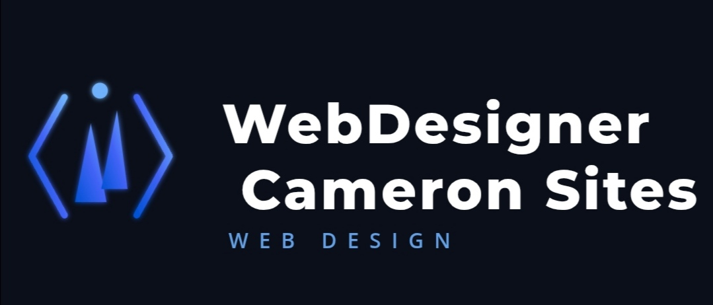

<h2>WebDesignerCameron Sites</h2>

The official WebDesignerCameron Sites 
website. Links:  
&bull; <a href="https://webdesignercameron.github.io/WebDesignerCameronSites" >The website</a> 
&bull; <a href="https://github.com/WebDesignerCameron" >WebDesignerCameron GitHub</a>
 
&bull; <a href="https://github.com/WebDesignerCameron/WebDesignerCameronSites/blob/main/contributors.md" >Contributors</a>
<h3>Overview</h3>
This repository serves as a centralized portfolio showcasing a diverse collection of web design and development projects created by WebDesignerCameron. Built and hosted via GitHub Pages, it offers a streamlined, accessible look into various web layouts, responsive designs, and front-end implementations. The project acts as both a living digital gallery for prospective clients or collaborators and a structured archive demonstrating growth in coding proficiency, user interface (UI) design, and modern web aesthetics.
